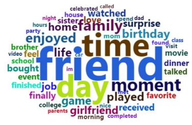

# Yonghao Xu (yx2838) Project 1: What is the relationship between the entertainment and happy moment?
## Spring2024
## Project 1: What is the relationship between the entertainment and happy moment?



+ Project summary: [a short summary] This project is dedicated to using natural language processing to analyze the occurrence of entertainment words and the influence of other factors in the huge HappyDB data. In this project, we analyzed the differences between men and women based on HappyDB, the top ten entertainment in the United States, and the differences between adults and minors. thank you all for watching


```
proj/
├── lib/
├── data/
├── doc/
├── figs/
└── output/
```

Please see each subfolder for a README file.
